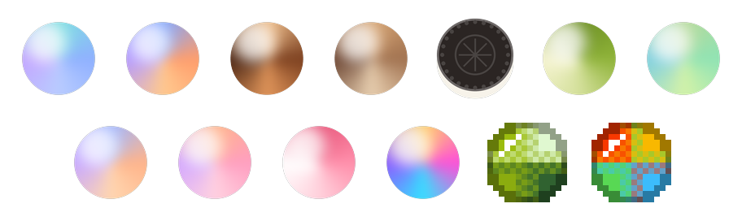

<p align="center">
  
</p>

<h1 align="center">PlaceHolder</h1>

<p align="center">a friend that lives on your desktop</p>

<p align="center">
  <a href="https://github.com/YourJunny/PlaceHolder/releases/latest/download/Placeholder-Setup-x64.exe"></a>
  <a href="https://github.com/YourJunny/PlaceHolder/releases/latest/download/Placeholder-mac-arm64.dmg"></a>
  <a href="https://github.com/YourJunny/PlaceHolder/releases/latest/download/Placeholder-mac-x64.dmg"></a>
  <a href="https://github.com/YourJunny/PlaceHolder/releases/latest/download/Placeholder-linux-x64.AppImage"></a>
</p>

<p align="center"><sub>it's free. don't know which mac you have? apple menu > about this mac. if it says M1, M2, M3 or M4 get the M1+ one, if it says intel get intel. the linux .deb is on the <a href="https://github.com/YourJunny/PlaceHolder/releases">releases page</a></sub></p>

## How to install

**Windows:** just run the setup file. Windows will probably pop up with "Windows protected your PC" because I haven't paid for a code signing thing yet. Hit **More info** then **Run anyway** and you're good.

**Mac:** open the .dmg and drag it into Applications. First time you open it your Mac is gonna say it can't check it for malware (same deal, no paid Apple dev account yet). Go to System Settings > Privacy & Security, scroll down a bit and hit **Open Anyway**. You only gotta do that once.

**Linux:** download the AppImage, right click it > Properties > let it run as a program (or `chmod +x` it), then open it. On Ubuntu/Debian/Mint you can grab the .deb from the releases page instead.

First time you open it, it downloads the AI stuff it needs. It's a few GB and it picks whatever fits your computer so give it a bit. After that it works offline.

## Why I made this

Every AI app I tried felt like talking to customer support. Long answers, bullet points, "Great question!", and the next day it has no clue who you are. You have to re-explain your whole life every time you open it.

I wanted something that felt more like texting a friend. Something that remembers your week, asks how the thing you were stressed about went, gets hyped when something good happens, and doesn't need an account or a monthly bill to do it. Nothing out there did all that so I just started building it myself.

It sits in your tray, you give it a name, and you just talk to it. It's not trying to be your therapist or your productivity coach. It's just there.

## What it's like

```
you:  got my road test tomorrow
      ugh
PH:   you've been practicing all month, you got this
PH:   what time?
you:  10
PH:   ok good luck 🤞

      ...next day...

PH:   so?? how'd the road test go
```

It texts short and casual like a normal person. It remembers what you tell it and brings stuff back up when it actually makes sense. It'll check in on its own too, but only around when you're usually on, and never when you're in the middle of something.

## Stuff it doesn't do (on purpose)

- **No lectures.** It won't write you an essay or talk like a help desk. If you need the heavy stuff it'll just tell you to go ask ChatGPT or Claude
- **No guilt.** No streaks to lose, no "I missed you 🥺". Gone for a week? It just says welcome back
- **No chasing.** If you're busy or ignoring it, it backs off. You can also tell it to give you space or turn on do not disturb
- **Doesn't make stuff up about you.** If it doesn't know, it says so
- **No secrets.** Everything it remembers about you is right there, you can look at all of it

## What's inside

### Chatting
- text it, send pics and videos, or hop on a voice call
- every day gets its own chat, and your day ends when you go to sleep not at midnight
- little strip at the top with whatever you've still got going on today
- right click a reply to see what it was thinking of when it said that
- hotkey to pull it up from anywhere, pop it out into a small window, or just keep it as a tiny floating orb
- pick its vibe (best friend, chill, hype, funny, cozy, wise, coach)

### Memory
- remembers people you mention, your plans and goals, and makes a timeline of your life
- every memory is a card, you can edit it, pin it, delete it, whatever
- stuff that doesn't come up much kind of fades into the background but nothing gets thrown out
- mark something "keep quiet" and it won't bring it up unless you do
- if you say something that doesn't match what you said before it'll double check with you
- coming from another AI? you can bring your memories over

### Keeping up with your life
- picks up tests, appointments and deadlines from normal convo
- reminders, repeating stuff, snooze
- asks how things went after, and remembers for next time
- birthdays for people in your life, it gives you a heads up a few days before
- you can import your school or work calendar

### Daily stuff (you can turn all of it off)
- morning card with the weather, your plans and a quote
- tells you when it starts raining
- fun facts, and a news tab for whatever you're into
- end of day wrap up, a sunday recap, and a letter about your month
- "on this day" throwbacks to stuff you told it months ago

### Gym and habits
- "hit 225 on bench" and it logs it. new PR? it gets hyped and tells you what your old one was
- habit tracking with streaks
- focus timer for when you need to lock in

### Studying
- drop in a pdf, slides or a word doc and it quizzes you on it
- timed practice tests, and it keeps track of your grades per class
- questions you get wrong come back a few days later
- explain something back to it and it tells you what you got right and what you missed

### Games
trivia, would you rather, 20 questions, word chain, finish my sentence, and a daily riddle

### Voice
- voice calls, push to talk, and a "hey (name)" wake word if you want it
- 28 voices, all running on your own computer

### Making it yours
- 24 companion looks (orb, cat, ghost, fox, dino, jellyfish...) plus 5 you have to unlock
- 16 styles, light/dark, 25 colors
- it grows the more days you talk to it
- 50+ badges, seasonal stuff, and the tray icon matches your theme

Some of the icon themes:

<p align="center">
  
</p>

## Your stuff stays yours

The AI runs on your own computer. No account, no subscription, no servers.

Your chats, memories and everything else stay on your computer. The only things that go online are your town or a topic name (for weather, news and fun facts) and a check for updates every few hours, which only sends the version number. You can turn all of that off. It also backs itself up every week and you can export everything whenever.

It picks an AI model that fits your computer too, so it works on normal laptops, not just gaming PCs.

## Where it's at

It's out! This is the first version so there's probably gonna be some bugs. Windows is what I've tested the most, Mac and Linux are brand new so if something's broken on those please tell me. It updates itself so you'll get fixes automatically (on Mac it just tells you when there's a new one).

## Something wrong?

Go to Settings > App > "Something wrong?" and it makes a bug report for you (your chats and memories aren't in it) and opens an email to me. Or just open an [issue](https://github.com/YourJunny/PlaceHolder/issues).

## Made with

Electron, React, TypeScript, Tailwind, SQLite, Ollama

---

<sub>© 2026 Junny. All rights reserved. Free to download and use, but the code isn't open source and nothing here gives you a license to copy, change or reupload the app, its code, or its assets.</sub>
